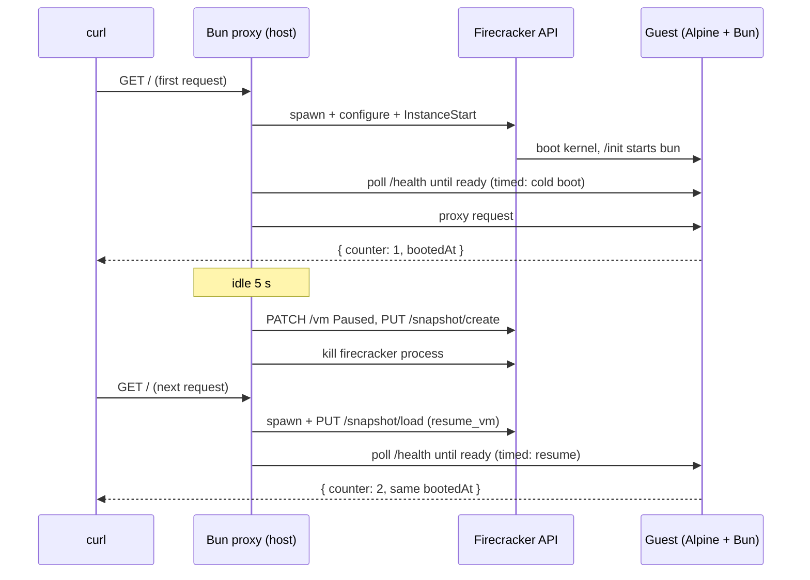

# Firecracker snapshot-resume demo

Companion demo for the talk *Micro VMs and Unikernels: The Cloud's Next Infrastructure Evolution*.

A Bun proxy on the host manages a Firecracker microVM running a tiny Bun HTTP server. The demo shows two things:

1. **The cold-start gap.** The first request cold-boots the VM (kernel boot plus app startup). After an idle period the proxy pauses the VM, writes a memory snapshot, and terminates the Firecracker process. The next request restores the VM from the snapshot instead of cold-booting. Both paths are timed end-to-end and printed side by side.
2. **Memory durability.** The guest server keeps a request counter in process memory. The counter survives the stop/start cycle because the snapshot captures the full memory state.

## Requirements

- Linux with KVM (`/dev/kvm` must exist and be accessible to your user).
  - Bare-metal Linux or a cloud instance with nested virtualization works.
  - **WSL2 needs extra setup** — nested virtualization plus loading the KVM module. See [wsl2-kvm-setup.md](wsl2-kvm-setup.md). If `ls /dev/kvm` still fails after that, run this demo elsewhere.
  - macOS does not work. Firecracker requires KVM.
- [Bun](https://bun.sh) on the host.
- `curl`, `unzip`, `mkfs.ext4` (package `e2fsprogs`), and `sudo`.
- x86_64 or aarch64.

## Setup

Run once, from this directory:

```sh
# 1. Install the Firecracker binary (pinned to v1.14.1)
./scripts/install-firecracker.sh

# 2. Download a Firecracker-compatible Linux kernel → .build/vmlinux
./scripts/download-kernel.sh

# 3. Build the guest rootfs (Alpine + Bun + guest/server.ts) → .build/rootfs.ext4
#    Needs sudo for the loop mount.
./scripts/build-rootfs.sh

# 4. Create the TAP network device (host 172.16.0.1, guest 172.16.0.2)
#    Re-run after every reboot — the device does not persist.
./scripts/setup-network.sh
```

## Run

```sh
bun run src/server.ts
```

Then drive it from another terminal:

```sh
curl localhost:8080        # cold boot — watch the proxy terminal for the timing
curl localhost:8080        # warm — VM already running, counter increments
# wait ~5 seconds — proxy snapshots the VM and kills the firecracker process
pgrep firecracker          # nothing — the VM is truly gone
curl localhost:8080        # resume — restored from memory in a fraction of the time
```

What to look for:

- The proxy prints `🥶 COLD BOOT <n> ms` and `🔥 RESUME <n> ms` with the speedup factor.
- The JSON response's `counter` keeps incrementing across the kill/resume cycle, and `bootedAt` never changes — the process never restarted, its memory came back from disk.
- Responses carry `x-vm-startup-path` (`cold-boot` / `warm` / `resume`) and `x-vm-startup-ms` headers.

The proxy deletes any existing snapshot on startup, so restarting `bun run server.ts` always re-arms the cold-boot path for a fresh run.

Environment variables: `PORT` (proxy port, default 8080), `IDLE_MS` (idle time before snapshot, default 5000).

## How it works



- **Host proxy** ([src/](src/)): serves on `:8080`, boots/resumes the VM on demand, proxies every request to the guest, snapshots after idle. Split by concern:
  - [src/server.ts](src/server.ts) — entry point: HTTP proxy, idle tracking.
  - [src/vm.ts](src/vm.ts) — lifecycle policy: cold boot, snapshot-resume, snapshot-and-stop (the timed paths).
  - [src/firecracker.ts](src/firecracker.ts) — the Firecracker process and its unix-socket management API.
  - [src/config.ts](src/config.ts) — every path, address, and knob.
- **Guest** ([guest/server.ts](guest/server.ts)): `Bun.serve` on `:8000` with an in-memory counter. [guest/init](guest/init) is PID 1 — it mounts `/proc` and `/sys` and execs Bun. Guest networking is configured by the kernel `ip=` boot parameter.
- **Networking**: one static TAP device (`fc-demo-tap`), created once by the setup script. No NAT — the host talks to the guest directly over the TAP subnet.
- **Snapshots**: Firecracker's `PATCH /vm {Paused}` + `PUT /snapshot/create` write a VM-state file and a memory file to `.build/snapshot/`. Resume spawns a fresh Firecracker process and `PUT /snapshot/load` with `resume_vm: true`.
