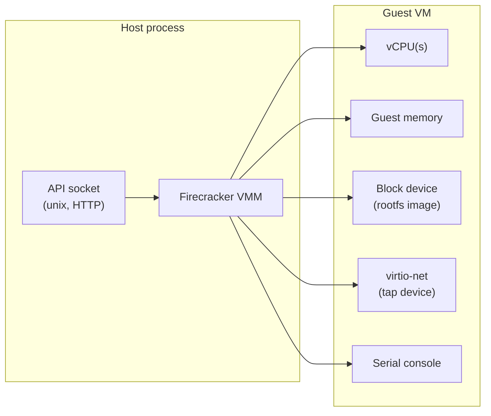
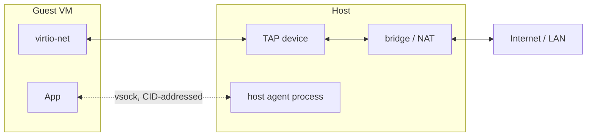

# microVMs and Unikernels

## The Cloud’s Next Infrastructure Evolution

<!--
The last comment block of each slide will be treated as slide notes. It will be visible and editable in Presenter Mode along with the slide. [Read more in the docs](https://sli.dev/guide/syntax.html#notes)
-->

---
layout: quote
clickAnimation: fade-in right
hide: true
---

# The serverless dilemma

<v-click>

The *big win* with serverless is paying only for what you use;

</v-click>

<v-click>

the *tradeoff* is accepting **cold starts**, **limited control**, and **vendor lock-in**.

</v-click>

<!--
- [click] The big win: you only pay for what you use.
- [click] The tradeoff: cold starts, limited control, and vendor lock-in.
-->

---
layout: two-cols-header
hide: true
---

# A fair trade

Serverless has generally been worth it

::left::

#### Benefits

- Better DX
- Reduced infra management
- Handles traffic spikes
- Usage pricing
- Scale-to-zero

::right::

#### Drawbacks

- Vendor lock-in
- Restrictive runtimes
- Limited control
- Cold start penalties

<!--
It depends on the application  
Some apps see more benefits, others aren't suitable
-->

---
layout: about-me
---

<!--
Prisma hosts applications and databases using microVMs  
We operate the bare metal machines and orchestration services to do so  
This gives us better performance, more ownership of our uptime, and cost savings
-->

---
layout: two-cols
---

# The plan

- Nostalgia
- microVMs & unikerneles
- Demo time
- Takeaways

::right::

  

---
layout: cover
---

# History

What have we tried and where are we now?

---
layout: image
image: https://media4.giphy.com/media/v1.Y2lkPTc5MGI3NjExNGEzczNsc3k0YzJuOHc1a3NtZmd5dXZvanRmaWhwbWZ1cGVnaGRndSZlcD12MV9pbnRlcm5hbF9naWZfYnlfaWQmY3Q9Zw/wR4bJk4jF5Tl6/giphy.gif
---

---

# History ⸱ servers to orchestration

<v-clicks>

  
Manual

  

    
<strong>scp / rsync / ftp</strong> straight to the server

    
simple on the surface, no repeatability, no rollback

  

  
2005 ⸱ VMs

  

    
Isolate workloads with VMs and template deployments

    
isolation and multi-tenancy, but slow boots and manual orchestration

  

  
2009 ⸱ Heroku

  

    
<code>git push heroku main</code> and it's live

    
the first pass at PaaS, but no portability and premium pricing

  

</v-clicks>

<!--
- [click] Manual: simple on the surface, but plagued by no repeatability, no isolation, no rollback, sequencing challenges.
- [click] VMs (2005): solved isolation and multi-tenancy, some repeatability; plagued by resource overhead, slow boot times, manual orchestration.
- [click] Heroku (2009): solved simple git-push deploys and add-ons; plagued by no portability, limited runtime, pricing. Ahead of its time — Docker brought portable competition, lack of investment led to its demise.
-->

---

# History ⸱ the cloud-native era

<v-clicks>

  
2013 ⸱ Containers + k8s

  

    
Repeatable deployment units that run anywhere

    
density and portability, but YAML sprawl and full-time cluster ops

  

  
2015 ⸱ FaaS

  

    
Deploy code, not infra

    
scale-to-zero simplicity, but cold starts, stateless, and vendor lock-in

  

  
2018 ⸱ PaaS

  

    
Intelligent deployments at a premium

    
modern DX, but still cold starts, lock-in, and abstraction layers

  

</v-clicks>

<!--
- [click] Containers + k8s (2013): solved density, portability, declarative deployment; plagued by YAML sprawl, full-time cluster ops, weakened isolation. First major step outside bespoke platforms — locally runnable, vendor portable, still dominant.
- [click] FaaS (2015): solved simple operation and scale-to-zero; plagued by cold starts, statelessness, vendor lock-in, runtime constraints. Traded too much for too little, but sparked the serverless category.
- [click] PaaS (2018): solved modernized deployments and dev focus; plagued by cold starts, vendor lock-in, abstraction layers, premium price. Heroku resurgence without Heroku — typically reselling a hyperscaler on k8s or lambda.
-->

---
layout: two-cols-header
---

# Reflections

Do you know where your applications are?

::left::

Your infrastructure probably sits in one of these categories.

You inherit the trade-offs of that category.

::right::

  

<!--
- Trade-offs are fine
- Workloads lean toward different solutions
- Opinionated is good, lock-in is bad.
-->

---
layout: cover
---

# microVMs & unikernels

Where we are headed

---
layout: image
image: https://media2.giphy.com/media/v1.Y2lkPTc5MGI3NjExYW56a3N6ZXhkcTZ6NGVudGk2MzFjY3ZsZDI1azJ0anJ4aWV3cDYwNSZlcD12MV9pbnRlcm5hbF9naWZfYnlfaWQmY3Q9Zw/118u58QrLaLnDG/giphy.gif
---

---
layout: two-cols-header
---

# microVMs

The better half of Lambda

A microVM is a highly optimized VM that boots in milliseconds.

::left::

<v-click>

#### Pros

- ✅ minimal device model
- ✅ no bootloader overhead
- ✅ low memory footprint <5MiB
- ✅ optimized for **high density**

</v-click>

::right::

<v-click>

#### Cons

- ❌ no shared kernel
- ❌ no standard image format
- ❌ not as user-friendly as Docker
- ❌ requires host virtualization support

</v-click>

<!--
[click] Pros: minimal device model, no bootloader overhead, low memory footprint <5MiB, optimized for high density.
- high density is an important takeaway

[click] Cons: no shared kernel, no standard image format, not as user-friendly as Docker, requires host virtualization support.

- no shared kernel is a security feature
- boots from fs images, so no image format is expected
- several projects have used OCI images to package firecracker VMs
- Docker doesn't need virtualization in Linux because it shares the kernel
-->

---

# Anatomy of a Firecracker VM

A handful of devices, wired together over one API socket

<!--
Device model is deliberately tiny.  
vCPUs  
Memory   
Block device — rootfs image  
virtio-net — virtual NIC  
Serial console — just enough for boot/debug output.  
One API socket configures all of it before boot — single control plane.  
No BIOS — skips POST and boot firmware entirely.  
No PCI bus — devices are fixed MMIO, nothing to discover.  
No legacy device emulation — unlike QEMU's floppy/VGA/sound baggage.
-->

---

# microVM Networking · TAP & vsock

Two communication channels for all your networking needs

<v-clicks>

- TAP device - a normal Linux network interface per VM
  - routable, filterable, rate-limitable like any NIC
  - bridge/NAT gets the guest to the LAN and internet
- vsock - a host-guest byte stream, not IP networking
  - addressed by CID, no routing table
  - terminates at one host process that sends/receives data

</v-clicks>

<!--
Guest only sees virtio-net. Host side is TAP.

[click] TAP = device-level primitive that plugs into the normal TCP/IP stack

[click] vsock = socket-level primitive that relays bytes without the need for a network stack
-->

---

# Firecracker added benefits

But wait! There's more!

Firecracker actually has many properties needed by an orhcestrator

<v-clicks>

- memory snapshot and restore
  - resume a VM with memory intact
- resource oversubscription
  - selectively grant memory to overcommit a host
- fairness and rate limiting
  - control VM network capacity and bandwidth
- API driven lifecycle
  - orchestrate Firecracker over HTTP

</v-clicks>

<!--
- [click] Memory snapshot and restore — resume a VM with memory intact.
- [click] Resource oversubscription — selectively grant memory to overcommit a host.
- [click] Fairness and rate limiting — control VM network capacity and bandwidth.
- [click] API driven lifecycle — orchestrate Firecracker over HTTP.
-->

---
layout: two-cols
---

# Unikernels

Cleaning out the syscall junk drawer

A typical Linux kernel is general purpose

Firecracker trims the distro modules but not the core

<v-click>

...but what if it was built for your app?

🗑️ scheduler  
🗑️ user/kernel boundary  
🗑️ multi-process machinery  
🗑️ device drivers  
🗑️ network stack  

</v-click>

::right::

<v-click>

</v-click>

<!--
Firecracker's kernel is already quite optimized
- No PCI, ACPI, SCSI, USB, GPU, BIOS
- Saves disk spaces and reduces startup time

[click] What if it was built for your app?
- Trim the scheduler.
- Trim the user/kernel boundary.
- Trim multi-process machinery.
- Trim device drivers.
- Trim the network stack.
-->

---

# Unikernels ⸱ collapsing the stack

Same hardware, one less boundary to cross

  

    
Traditional VM

    
App

    
Userspace: shell, package manager

    
Syscall boundary

    
Kernel: scheduler, drivers, network stack, multi-process

    
Hardware / vCPU

  

  

    
Unikernel VM

    
App + only the libraries it links

    
Hardware / vCPU

  

<!--
Left: a traditional VM has an app running in userspace, crossing a syscall boundary into a general-purpose kernel to reach the hardware.

Right: a unikernel links the app directly against just the libraries it needs into a single image, in a single address space, with no syscall boundary to cross.
Fewer layers isn't just tidier — every removed boundary is a removed context switch.
-->

---
layout: two-cols-header
---

# Serverless platforms

No longer limited to functions

The next generation of serverless platforms runs more than a function.

::left::

<v-click>

#### Applications with

- unrestricted runtimes
- long-running memory
- scale-to-zero and instantly resume

</v-click>

<v-click>

***

#### Databases with

- no cold starts
- usable cache
- standby without dropping connections

</v-click>

::right::

<v-click>

</v-click>

---
layout: cover
---

# Demo

[github.com/rtbenfield/talks-carolina-codes-2026](https://github.com/rtbenfield/talks-carolina-codes-2026)

---
zoom: 1
---

# The app inside the VM

An ordinary server with in-memory state

<<< @/demo/guest/server.ts ts {all|4-5|15|16}

<!--
Here's the entire workload the demo ran inside the microVM.
Notice there's no special behavior.

- [click] The two things to keep an eye on: a counter and a boot timestamp, both living in plain process memory — no database, no disk.
- [click] Each request increments the counter.
- [click] And each response reports both. Remember what these did across the kill/resume cycle — we'll come back to them.
-->

---

# A working orchestrator

An HTTP proxy that routes to a scale-to-zero Firecracker microVM

<SlidevVideo autoplay autoreset="slide" muted playsinline aria-label="Terminal recording: cold boot, idle snapshot kills the firecracker process, resume restores memory in a fraction of the time with the request counter intact" class="dark:hidden h-90 mx-auto mt-4 rounded-lg shadow-lg">
  <source src="/firecracker-demo-light.webm" type="video/webm" />
</SlidevVideo>
<SlidevVideo autoplay autoreset="slide" muted playsinline aria-label="Terminal recording: cold boot, idle snapshot kills the firecracker process, resume restores memory in a fraction of the time with the request counter intact" class="hidden dark:block h-90 mx-auto mt-4 rounded-lg shadow-lg">
  <source src="/firecracker-demo-dark.webm" type="video/webm" />
</SlidevVideo>

<!--
Recorded run of the demo. Re-record from demo/ with `vhs demo-light.tape` and `vhs demo-dark.tape` (shared steps live in demo-steps.tape).
The arc: cold boot → warm request → idle snapshot kills the VM process → pgrep proves it's gone → resume from the memory snapshot 15× faster, counter and bootedAt intact.
-->

---
zoom: 0.9
---

# A VM is just a process

No daemon, just a process per VM

<<< @/demo/src/firecracker.ts#spawn ts {all|6-9|10-11|13-22}

<!--
This is how every VM in the demo came to exist.

- [click] Bun.spawn on a plain binary. One firecracker process per VM.
- [click] The guest's serial console is just the process's stdout.
- [click] Then poll until the API socket answers. At this point firecracker is running but empty but without a VM definition.
-->

---

# The control plane is just HTTP

Firecracker is orchestrated over a unix socket

<<< @/demo/src/firecracker.ts#fc-api ts {all|5}

<!--
Everything the demo did — boot, pause, snapshot, resume — goes through this one function.
No SDK, no client library. A REST API over a unix socket.

- [click] The only unusual part: fetch pointed at a unix socket instead of a TCP port.
-->

---
zoom: 0.9
---

# Cold boot: a VM from five API calls

<<< @/demo/src/vm.ts#cold-boot ts {all|3|4-5|6-16|17|18|20-22}

<!--
This is the entire cold-boot path from the demo.

- [click] Spawn the firecracker process. It starts empty, no VM yet.
- [click] Tell it the shape: 1 vCPU, 256 MiB, and which kernel to boot.
- [click] Attach a root disk and a network interface.
- [click] InstanceStart boots the guest kernel.
- [click] Poll the guest's HTTP server until it answers.
- [click] That whole span is the cold-boot number you saw: kernel boot plus app startup.
-->

---
zoom: 0.9
---

# Scale to zero: pause, snapshot, kill

<<< @/demo/src/vm.ts#snapshot-and-stop ts {all|12|13-17|19-21}

<!--
After the idle timeout, the proxy retires the VM.

- [click] Pause the guest so memory stops changing.
- [click] One API call writes the full VM state and memory to two files on disk.
- [click] Then kill -9 the firecracker process. Nothing is left running. Complete resource cleanup apart from files on disk.
-->

---

# Resume: memory comes back from disk

The guest never knew it was gone

<<< @/demo/src/vm.ts#resume ts {all|3-11|9-10|12}

<!--
The next request takes this path instead of the cold boot.

- [click] Spawn a fresh firecracker process and load the snapshot. No kernel boot, no app startup.
- [click] resume_vm: true means the guest continues from the exact instruction it was paused at.
- [click] Same readiness poll as cold start but observed much faster.

And this is why the counter kept counting and bootedAt never changed: the process didn't restart. Its memory came back from a file.
-->

---
layout: two-cols-header
---

# Takeaways

What if I just want to ship?

::left::

<v-click>

I'm an infra provider

- Unmatched server density
- Strong isolation
- Scale to zero without cold starts

but...

- Works best on bare metal
- Needs more orchestration

</v-click>

::right::

<v-click>

I'm an app developer

- Is your workload intermittent?
- Are you suffering from cold starts?
- Are you paying for idle resources?
- Do you need dynamic resources?

either...

- Match your infra to your workload
- Match your workload to your infra

</v-click>

<!--
- [click] Infra provider's pitch: unmatched density, strong isolation, scale-to-zero without cold starts — but works best on bare metal and needs more orchestration.
- [click] App developer's checklist: intermittent workloads, cold starts, idle spend, dynamic resource needs — match your infra to your workload, or your workload to your infra.
- Most people choose the infra provider that looks easiest
- Consider what your workload needs
- Intermittent workloads want serverless but suffer cold starts
- Cold starts vary by provider implementation

The best is something that feels serverful but is actually serverless
-->

---
layout: cover
---

# That's a wrap

[github.com/rtbenfield/talks-carolina-codes-2026](https://github.com/rtbenfield/talks-carolina-codes-2026)

